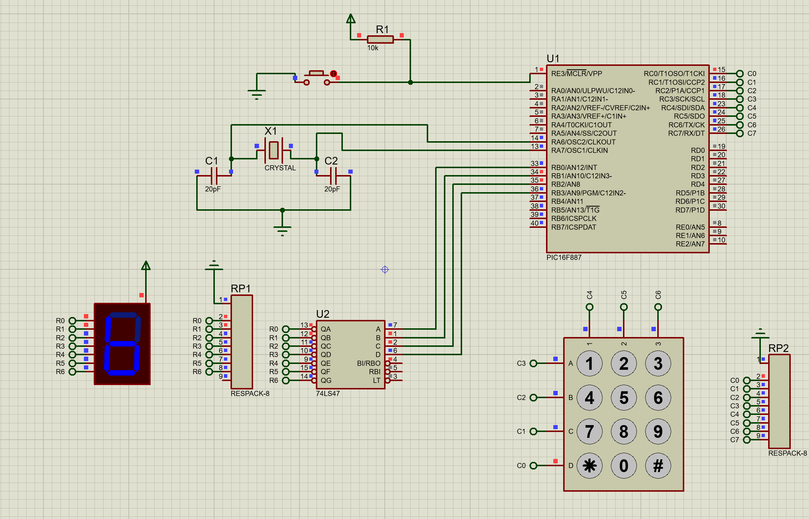

# PIC16F887 Keypad and 7-Segment Display Circuit

This project demonstrates how to interface a keypad and a 7-segment display with a PIC16F887 microcontroller. The circuit is designed using Proteus ISIS, and the code is written in mikroC.

## Project Overview

The circuit allows you to:
- Press keys `0-9` to display the corresponding digit on the 7-segment display.
- Press `*` to display the letter `E`.
- Press `#` to display the letter `F`.

### Components Used
- **Microcontroller**: PIC16F887
- **Display**: 7-segment display (common cathode)
- **Keypad**: 4x3 matrix keypad
- **Decoder**: BCD to 7-segment decoder (if applicable)
- **Software**: Proteus ISIS for simulation, mikroC for programming

## Repository Structure

The repository contains the following files:
1. **Circuit Diagram**: `screen/7_seg_&_keypad.png`  
   - A visual representation of the circuit designed in Proteus ISIS.
2. **Proteus Project File**: `7_seg_&_keyboard.pdsprj`  
   - The Proteus ISIS project file for simulating the circuit.
3. **mikroC Code**: `tp3_7_seg___keyboard.c`  
   - The mikroC source code for the PIC16F887 microcontroller.

## Circuit Description

### Circuit
  

### Keypad Connections
- **Rows**: Connected to `PORTC` (RC0, RC1, RC2, RC3)
- **Columns**: Connected to `PORTC` (RC4, RC5, RC6)

### 7-Segment Display Connections
- **BCD Input**: Connected to `PORTB` (RB0, RB1, RB2, RB3)
- **Decoder**: The decoder is connected between the microcontroller and the 7-segment display.

## Instructions
1. Open the `7_seg_&_keyboard.pdsprj` file to view the circuit setup.
2. Load `tp3_7_seg___keyboard.c` into MikroC and compile it to generate the hex file.
3. Upload the hex file to the microcontroller in Proteus.
4. Run the simulation to observe the LED blinking.

## Tools
- MikroC Pro for PIC
- Proteus ISIS

